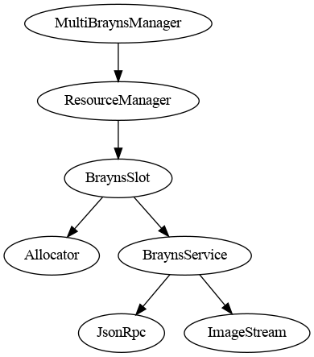

# MultiBraynsManager

```ts
const manager = MultiBraynsManager.getInstance();
```

`MultiBraynsManager` is responsible of displaying simulations on up to 9 canvases.
Behind the scene, it deals with resource allocation and network communication with
all the needed Brayns instances.

We call **slotId** an integer between 0 and 9 that refers to a Brayns instance.

The interface is minimal. `MultiBraynsManager` provides only 4 methods:

- `attachCanvas()`: Attach a canvas to a slot.
  All images from this Brayns instance will be drawn on this canvas.
  And every mouse interaction will move the camera.
- `detachCanvas()`: Detach a canvas from a slot.
- `loadSimulation()`: Define what circuit and simmulation a Brayns instance will render.
- `setSimulationFrame()`: A simulation can be seen as is a list frames.
  Each frame is a snapshot at a specific time of the values we are interested in (voltages, ...).

Finally, the camera can be controlled with the property `camera`.
This camera is shared between all the slots.


